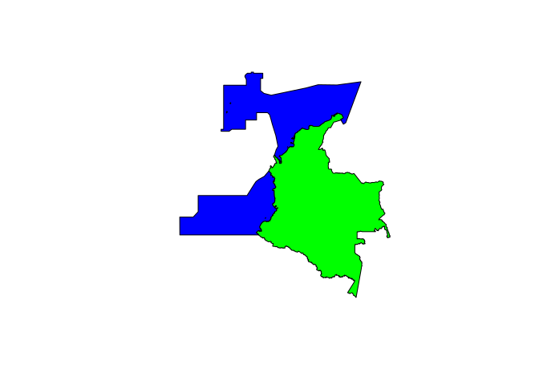
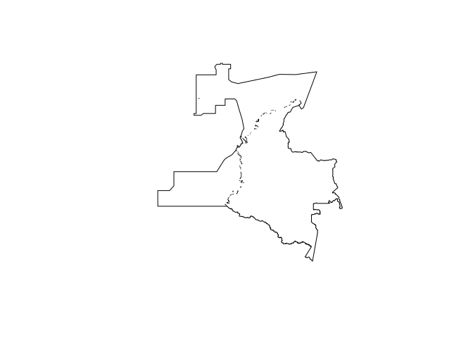

# Explorar la API SQL de Gbif para incorporar datos en la base de datos
Marius Bottin

Para descargar los datos de ocurencias que se van a analisar en las
plataformas, una de las soluciones recientes es utilizar una nueva API
de Gbif que permite el uso de un lenguaje SQL. La documentación precisa
que esa funcionalidad es todavía experimental y que su codificación
podría cambiar en los proximos meses. Sin embargo permite filtrar las
columnas que se descargan, lo que presenta ventajas para las
dificultades de memoria que tenemos en los scripts de
`Biodiversidad en Cifras` y `Visor Geográfico`.

Existen 2 paquetes que pueden servir de interfaz para la API SQL de
Gbif: \* `rgbif` es un paquete de R basado sobre las API de GBIF,
desarrollado por el grupo [ROpenSci](https://ropensci.org/) (uno de los
contributores mayores de ciencia abierta en R) \* `pygbif` es un paquete
Python que tiene más o menos las mismas posibilidades que el paquete R,
desarrollado directamente por los equipos de GBIF

Para explorar las posibilidades de la API SQL, voy a utilizar en una
primera instancia el paquete de R, sin embargo, en el futuro podríamos
utilizar Python para integrar codigo en las funciones generales de este
repositorio

## Probar la API y `rgbif`

### Configuración

Para utilizar la API y el paquete, se necesita un usuario GBIF.

Para pasar las información a R en su sesión por favor referirse a
<https://docs.ropensci.org/rgbif/articles/gbif_credentials.html>. En
nuestro caso, utilizamos un .Renviron file, a escala del proyecto R
asociado con este repositorio. Para evitar dar nuestros credenciales al
mundo, lo que hicimos es añadir la fila `**/.Renviron` al archivo
.gitignore del repositorio. Lo que quiere decir es que no se va a
compartir en el repositorio la configuración de credenciales de GBIF, y
que las personas que quieren reproducir el codigo utilizado acá tienen
que crear su propia configuración.

### Test

Para que funcione la importación de resultados desde una consulta SQL en
la API de GBIF a traves del paquete de R, el proceso incluye varias
etapas:

1.  probar de manera rapida que la consulta SQL es valida con
    `occ_download_sql_prep`
2.  enviar la consulta en GBIF con `occ_download_sql`
3.  GBIF prepara y corre la consulta en sus servidore, los usuarios
    pueden seguir el estado y esperar las respuesta con
    `occ_download_wait`
4.  cargar el resultado con `occ_download_import`

``` r
library(rgbif)
```

``` r
test_countCol <- occ_download_sql_prep("SELECT count(gbifid) FROM occurrence WHERE countrycode='CO'")
(countCol<-occ_download_sql("SELECT count(gbifid) FROM occurrence WHERE countrycode='CO'"))
occ_download_wait(countCol)
(res<-occ_download_import(countCol))
```

## Country code versus poligono: cuales son las diferencias

En este proyecto, vamos a descargar datos continentales y marinos, es
importante averiguar cuales son las implicaciones de descargar los datos
desde un countrycode o un poligono que integra las zonas maritimas del
país.

Para hacer eso, descargamos los polígonos en una carpeta local (fuera
del repositorio). Para reproducir este codigo es importante descargar
las fuentes en una carpeta ubicada al mismo nivel que la carpeta del
repositorio llamada `data_sintesis-biocifras`

``` r
library(sf)
```

    Linking to GEOS 3.13.0, GDAL 3.12.1, PROJ 9.4.1; sf_use_s2() is TRUE

``` r
DSN <- "../../data_sintesis-biocifras/"
reg_mar<-st_read(dsn=DSN,layer = "RegionesMaritimas")
```

    Reading layer `RegionesMaritimas' from data source 
      `/home/marius/Travail/traitementDonnees/2026_scripts_filter_sintesis_cifras/data_sintesis-biocifras' 
      using driver `ESRI Shapefile'
    Simple feature collection with 5 features and 2 fields
    Geometry type: POLYGON
    Dimension:     XY
    Bounding box:  xmin: -85.9926 ymin: 1.429 xmax: -69.4917 ymax: 16.1694
    Geodetic CRS:  WGS 84

``` r
depto<-st_read(dsn=DSN, layer="MGN_DPTO_POLITICO_2023")
```

    Reading layer `MGN_DPTO_POLITICO_2023' from data source 
      `/home/marius/Travail/traitementDonnees/2026_scripts_filter_sintesis_cifras/data_sintesis-biocifras' 
      using driver `ESRI Shapefile'
    Simple feature collection with 33 features and 9 fields
    Geometry type: MULTIPOLYGON
    Dimension:     XY
    Bounding box:  xmin: -81.73562 ymin: -4.229406 xmax: -66.84722 ymax: 13.39473
    Geodetic CRS:  WGS 84

``` r
plot(c(st_geometry(st_union(st_make_valid(reg_mar))),st_geometry(st_union(st_make_valid(depto)))),col=c("blue","green"))
```



Exportar el WKT:

``` r
all_col_poly<-st_simplify(st_union(st_union(st_make_valid(reg_mar)),st_union(st_make_valid(depto))),dTolerance=100)
plot(st_geometry(all_col_poly))
```



``` r
wkt_col<-st_as_text(all_col_poly)
```

``` r
valid_wkt<-check_wkt(wkt_col)
```

``` r
bb<-st_bbox(all_col_poly)
```

``` r
polyOrCountry_query<-paste0("SELECT countrycode,hasgeospatialissues,count(*) 
       FROM occurrence 
       WHERE countrycode='CO' 
        OR 
          (decimalLatitude <= ",bb["ymax"], " AND decimalLatitude >= ",bb["ymin"], " AND decimalLongitude <= ", bb["xmax"], " AND decimalLongitude >= ", bb["xmin"]," 
          AND GBIF_WITHIN('",valid_wkt,"', decimalLatitude, decimalLongitude)
          )
       GROUP BY countrycode, hasgeospatialissues" )
test_polyOrCountry<-occ_download_sql_prep(polyOrCountry_query)
(polyOrCountry<-occ_download_sql(polyOrCountry_query))
```

    <<gbif download sql>>
      Your download is being processed by GBIF:
      https://www.gbif.org/occurrence/download/0082621-260226173443078
      Check status with
      occ_download_wait('0082621-260226173443078')
      After it finishes, use
      d <- occ_download_get('0082621-260226173443078') %>%
        occ_download_import()
      to retrieve your download.
    Download Info:
      Username: bottinmarius
      E-mail: m.bottin_pro@yahoo.com
      Format: SQL_TSV_ZIP
      Download key: 0082621-260226173443078
      Created: 2026-04-03T21:01:03.966+00:00
    Citation Info:  
      Please always cite the download DOI when using this data.
      https://www.gbif.org/citation-guidelines
      DOI: 
      Citation:
      GBIF Occurrence Download https://www.gbif.org/occurrence/download/0082621-260226173443078 Accessed from R via rgbif (https://github.com/ropensci/rgbif) on 2026-04-03

``` r
occ_download_wait(polyOrCountry)
```

    status: preparing

    status: running

    status: succeeded

    download is done, status: succeeded

    <<gbif download metadata>>
      Status: SUCCEEDED
      DOI: 10.15468/dl.pywwwt
      Format: SQL_TSV_ZIP
      Download key: 0082621-260226173443078
      Created: 2026-04-03T21:01:03.966+00:00
      Modified: 2026-04-04T01:32:07.505+00:00
      Download link: https://api.gbif.org/v1/occurrence/download/request/0082621-260226173443078.zip
      Total records: 91

``` r
(res<-occ_download_get(polyOrCountry) %>% occ_download_import())
```

    Download file size: 0 MB

    On disk at ./0082621-260226173443078.zip

| countrycode | hasgeospatialissues | COUNT(\*) |
|:------------|:--------------------|----------:|
| CO          | FALSE               |  40125397 |
| PE          | FALSE               |      4140 |
| CO          | TRUE                |     27951 |
| MX          | TRUE                |        30 |
| BR          | FALSE               |       853 |
| NI          | FALSE               |      3898 |
| EC          | FALSE               |      5285 |
| VE          | FALSE               |      5312 |
| CR          | TRUE                |       127 |
| PA          | TRUE                |       641 |
| HN          | TRUE                |        18 |
| MS          | TRUE                |        14 |
| IS          | TRUE                |         9 |
| AR          | TRUE                |        65 |
| US          | TRUE                |       459 |
| EC          | TRUE                |       523 |
| VE          | TRUE                |       932 |
| BR          | TRUE                |       434 |
| NI          | TRUE                |       223 |
| PA          | FALSE               |       937 |
| DO          | TRUE                |        13 |
| PE          | TRUE                |       151 |
| ZZ          | TRUE                |       860 |
| JM          | TRUE                |        29 |
|             | FALSE               |     10094 |
| MZ          | TRUE                |         1 |
| CA          | TRUE                |        54 |
| CR          | FALSE               |      1807 |
| ES          | TRUE                |         5 |
| BO          | TRUE                |        13 |
| GY          | TRUE                |        20 |
| TW          | TRUE                |         1 |
| TT          | TRUE                |        26 |
| JM          | FALSE               |       156 |
| VC          | TRUE                |         3 |
| ME          | TRUE                |         1 |
| RS          | TRUE                |         4 |
| SH          | TRUE                |         7 |
| AW          | FALSE               |        14 |
| SE          | TRUE                |         1 |
| RU          | TRUE                |         2 |
| AF          | TRUE                |        27 |
| PR          | TRUE                |         1 |
| NA          | TRUE                |         1 |
| HT          | TRUE                |         2 |
| AW          | TRUE                |        12 |
| CU          | TRUE                |         3 |
| GN          | TRUE                |         1 |
| GR          | TRUE                |        29 |
| CL          | TRUE                |         7 |
| TC          | TRUE                |         1 |
| PM          | TRUE                |        14 |
| WS          | TRUE                |         1 |
| IT          | TRUE                |         1 |
| SV          | TRUE                |        21 |
| BZ          | TRUE                |         1 |
| GT          | TRUE                |         2 |
| VN          | TRUE                |         1 |
| SR          | TRUE                |         2 |
| LB          | TRUE                |         3 |
| TN          | TRUE                |         2 |
| AM          | TRUE                |         9 |
| MA          | TRUE                |         3 |
| GF          | TRUE                |         1 |
| PY          | TRUE                |         2 |
| BS          | TRUE                |         5 |
| PS          | TRUE                |        11 |
| AL          | TRUE                |        68 |
| CN          | TRUE                |         1 |
| CD          | TRUE                |         1 |
| CC          | TRUE                |         1 |
| TG          | TRUE                |         1 |
| PT          | TRUE                |         3 |
| CH          | TRUE                |         5 |
| AG          | TRUE                |         3 |
| EH          | TRUE                |         2 |
| NZ          | TRUE                |         3 |
| GD          | TRUE                |         6 |
| GA          | TRUE                |         1 |
| TR          | TRUE                |         1 |
| CW          | TRUE                |         1 |
| DO          | FALSE               |         1 |
| ID          | TRUE                |         1 |
| LC          | TRUE                |         7 |
| KR          | TRUE                |         8 |
| CM          | TRUE                |         1 |
| FR          | TRUE                |         1 |
| JP          | TRUE                |         1 |
| PG          | TRUE                |         1 |
| MY          | TRUE                |         1 |
| ZM          | TRUE                |         1 |
