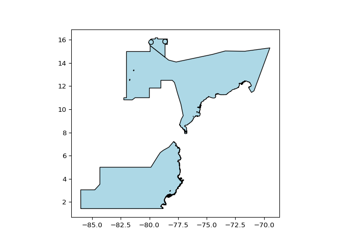
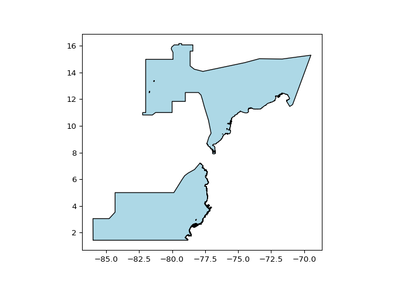
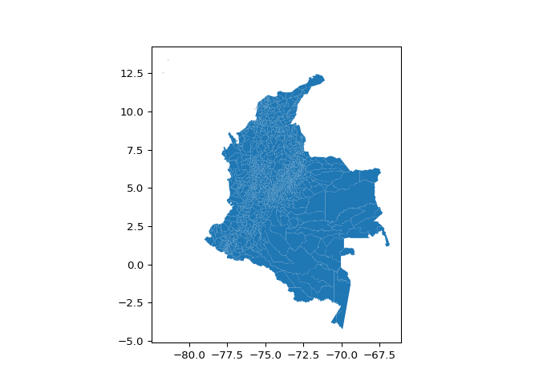
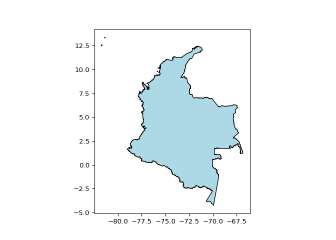
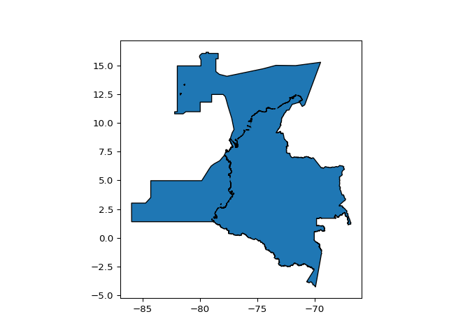
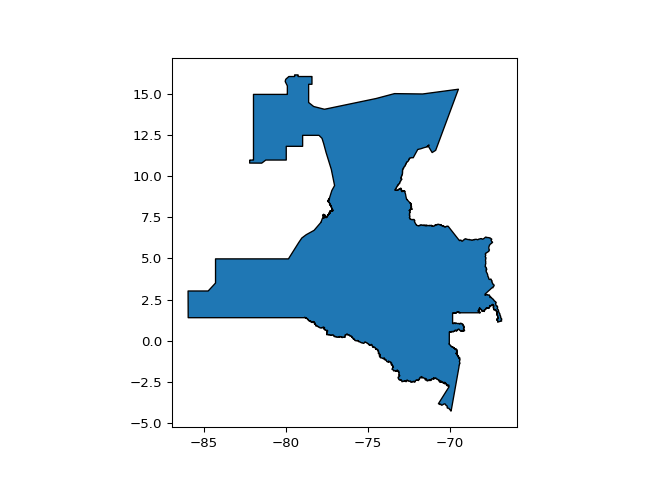
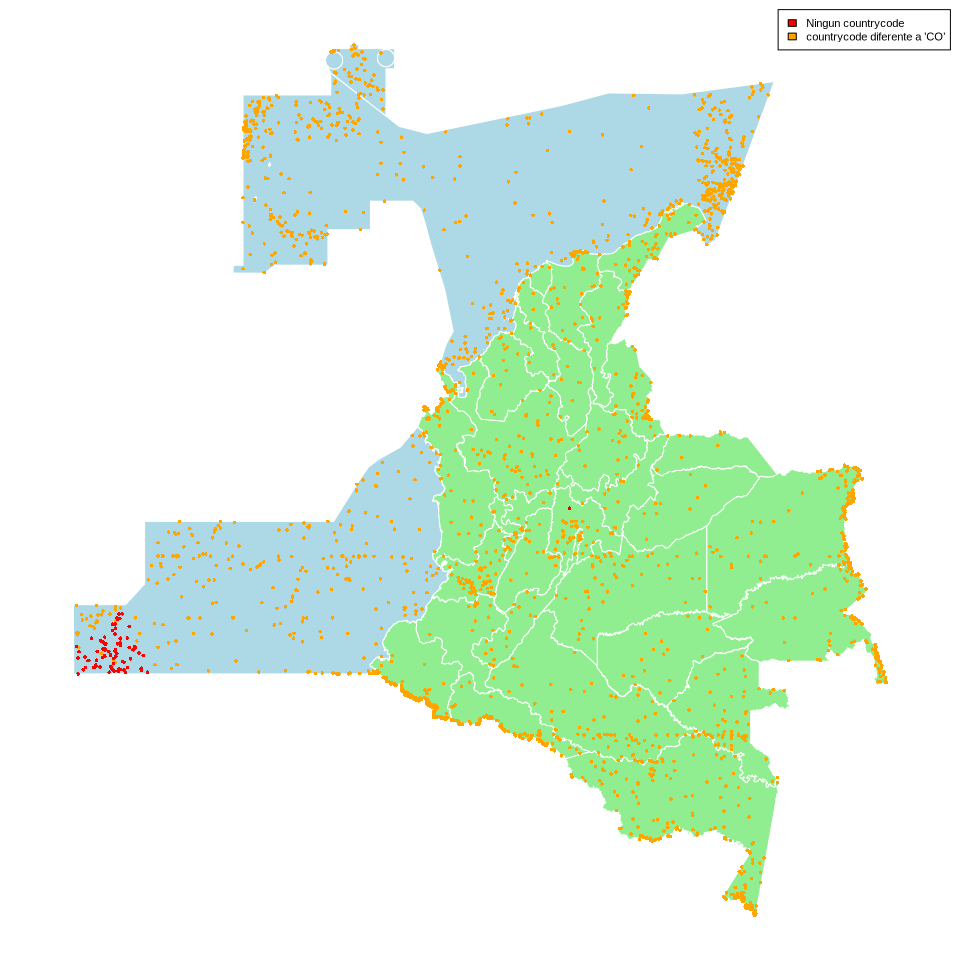

# Descargar datos desde pygbif
Marius Bottin

## `pyGbif`: la lista de descargas

`pyGbif` es un paquete de python que permite manejar la API de GBIF. En
particular, el modulo `occurrences` permite manejar las descargas de
conjunto de datos a través de la API. Sin embargo es importante anotar
que el modulo no permite importar los conjuntos de datos, simplemente su
descarga.

Primero es importante incluir el archivo .env con los usuarios y
contraseñas de GBIF.

``` python
import os
from dotenv import load_dotenv, dotenv_values
from pygbif import occurrences as occ
from tabulate import tabulate
import pandas as pd
import json
load_dotenv()
```

    True

``` python
print(os.getenv("GBIF_USER"))
```

    bottinmarius

La lista de descarga permite descargar los metadatos de las descargas
presentes en el perfil del usuario de GBIF

``` python
#ref_occ_down = occ.download_sql("SELECT gbifid, ScientificName, countryCode FROM occurrence WHERE genus='Espeletia' LIMIT 10")
#occ.download_meta(ref_occ_down)
downList = occ.download_list()
df_downList = pd.json_normalize(downList["results"])
df_downList.columns
```

Index(\[‘key’, ‘doi’, ‘license’, ‘created’, ‘modified’, ‘eraseAfter’,
‘status’, ‘downloadLink’, ‘size’, ‘totalRecords’, ‘numberDatasets’,
‘source’, ‘request.sql’, ‘request.creator’,
‘request.notificationAddresses’, ‘request.sendNotification’,
‘request.format’, ‘request.type’, ‘request.predicate.type’,
‘request.predicate.key’, ‘request.predicate.value’,
‘request.predicate.matchCase’, ‘request.verbatimExtensions’,
‘request.interpretedExtensions’\], dtype=‘str’)

``` python
df_downList2 = df_downList[['key', 'doi','created','status','request.sendNotification','downloadLink']]
print(tabulate(df_downList2, headers = 'keys', tablefmt = 'github'))
```

|  | key | doi | created | status | request.sendNotification | downloadLink |
|----|----|----|----|----|----|----|
| 0 | 0021086-260409193756587 | 10.15468/dl.cvycbf | 2026-04-15T20:09:50.347+00:00 | SUCCEEDED | True | https://api.gbif.org/v1/occurrence/download/request/0021086-260409193756587.zip |
| 1 | 0014838-260409193756587 | 10.15468/dl.dgnk5q | 2026-04-14T13:17:44.430+00:00 | SUCCEEDED | True | https://api.gbif.org/v1/occurrence/download/request/0014838-260409193756587.zip |
| 2 | 0013205-260409193756587 | nan | 2026-04-14T02:28:48.246+00:00 | CANCELLED | True | https://api.gbif.org/v1/occurrence/download/request/0013205-260409193756587.zip |
| 3 | 0011853-260409193756587 | 10.15468/dl.wjqax9 | 2026-04-13T16:55:33.892+00:00 | SUCCEEDED | True | https://api.gbif.org/v1/occurrence/download/request/0011853-260409193756587.zip |
| 4 | 0002968-260409193756587 | 10.15468/dl.d5u7xz | 2026-04-11T03:02:40.859+00:00 | SUCCEEDED | True | https://api.gbif.org/v1/occurrence/download/request/0002968-260409193756587.zip |
| 5 | 0002247-260409193756587 | 10.15468/dl.q749s6 | 2026-04-10T20:25:47.789+00:00 | SUCCEEDED | True | https://api.gbif.org/v1/occurrence/download/request/0002247-260409193756587.zip |
| 6 | 0001627-260409193756587 | 10.15468/dl.b8bq55 | 2026-04-10T15:45:40.874+00:00 | SUCCEEDED | True | https://api.gbif.org/v1/occurrence/download/request/0001627-260409193756587.zip |
| 7 | 0001625-260409193756587 | 10.15468/dl.b3vtxm | 2026-04-10T15:44:48.512+00:00 | SUCCEEDED | True | https://api.gbif.org/v1/occurrence/download/request/0001625-260409193756587.zip |
| 8 | 0001617-260409193756587 | 10.15468/dl.h2hk99 | 2026-04-10T15:40:48.745+00:00 | SUCCEEDED | True | https://api.gbif.org/v1/occurrence/download/request/0001617-260409193756587.zip |
| 9 | 0082621-260226173443078 | 10.15468/dl.pywwwt | 2026-04-03T21:01:03.966+00:00 | SUCCEEDED | False | https://api.gbif.org/v1/occurrence/download/request/0082621-260226173443078.zip |
| 10 | 0082571-260226173443078 | 10.15468/dl.hf8r23 | 2026-04-03T20:46:34.621+00:00 | SUCCEEDED | False | https://api.gbif.org/v1/occurrence/download/request/0082571-260226173443078.zip |
| 11 | 0065380-260226173443078 | 10.15468/dl.y8375s | 2026-03-27T21:06:00.411+00:00 | SUCCEEDED | False | https://api.gbif.org/v1/occurrence/download/request/0065380-260226173443078.zip |
| 12 | 0065368-260226173443078 | nan | 2026-03-27T20:48:37.673+00:00 | CANCELLED | False | https://api.gbif.org/v1/occurrence/download/request/0065368-260226173443078.zip |
| 13 | 0064920-260226173443078 | nan | 2026-03-27T15:08:16.378+00:00 | FAILED | False | https://api.gbif.org/v1/occurrence/download/request/0064920-260226173443078.zip |
| 14 | 0064894-260226173443078 | 10.15468/dl.ytr8y9 | 2026-03-27T14:55:36.702+00:00 | SUCCEEDED | False | https://api.gbif.org/v1/occurrence/download/request/0064894-260226173443078.zip |
| 15 | 0064859-260226173443078 | 10.15468/dl.2zptkn | 2026-03-27T14:41:33.806+00:00 | SUCCEEDED | False | https://api.gbif.org/v1/occurrence/download/request/0064859-260226173443078.zip |
| 16 | 0064834-260226173443078 | 10.15468/dl.k8xwmr | 2026-03-27T14:28:53.677+00:00 | SUCCEEDED | False | https://api.gbif.org/v1/occurrence/download/request/0064834-260226173443078.zip |
| 17 | 0027989-180131172636756 | 10.15468/dl.9ggjke | 2018-04-02T14:59:29.957+00:00 | SUCCEEDED | True | https://api.gbif.org/v1/occurrence/download/request/0027989-180131172636756.zip |
| 18 | 0027985-180131172636756 | 10.15468/dl.awmqai | 2018-04-02T14:27:14.581+00:00 | SUCCEEDED | True | https://api.gbif.org/v1/occurrence/download/request/0027985-180131172636756.zip |
| 19 | 0095338-160910150852091 | 10.15468/dl.reshq8 | 2017-05-30T19:48:22.381+00:00 | SUCCEEDED | True | https://api.gbif.org/v1/occurrence/download/request/0095338-160910150852091.zip |

Podemos utilizar esta lista para probar si ya se descargo, a través de
la API SQL una consulta SQL (Nota: imagino que cuando son consultas
complejas, podríamos tener problemas con los cambios de linea):

``` python
def is_in_my_download_list(sql_query, limit=20):
  downList = occ.download_list(limit=limit)
  df_downList = pd.json_normalize(downList["results"])
  df_downList_SQLok = df_downList[df_downList["request.sql"] == sql_query]
  tableOK = df_downList_SQLok.query('status == "PREPARING" or status == "RUNNING" or status == "SUCCEEDED"')
  sizeMatch = tableOK.size
  return sizeMatch>0

query = "SELECT gbifid, ScientificName, countryCode FROM occurrence WHERE genus='Espeletia' LIMIT 10"
is_in_my_download_list(query)
```

    True

Incluso podemos mirar cual es el “key” de descarga que corresponde a la
consulta SQL:

``` python
def get_query_key(sql_query, limit=20):
  downList = occ.download_list(limit=limit)
  df_downList = pd.json_normalize(downList["results"])
  df_downList_SQLok = df_downList[df_downList["request.sql"] == sql_query]
  tableOK = df_downList_SQLok.query('status == "PREPARING" or status == "RUNNING" or status == "SUCCEEDED"')
  lastKey = tableOK['key'].values[0]
  return lastKey

get_query_key(query)
```

    '0002247-260409193756587'

## Hacer una función Wait

Gracias a la función `download_meta` podemos mirar el estatus de la
descarga, que cuando todo va bien pasa de ‘PREPARING’ a ‘RUNNING’ a
‘SUCCEEDED’

``` python
def download_status(key):
  status = occ.download_meta(key)['status']
  return status
  
download_status(get_query_key(query))
```

    'SUCCEEDED'

Entonces, podemos crear una función wait, para esperar que el estatus
llegue a ‘SUCCEEDED’, y muestre los cambios de estatus:

``` python
"""
Potential statuses of a download in gbif PREPARING, RUNNING, SUCCEEDED, CANCELLED, KILLED, FAILED, SUSPENDED, FILE_ERASED
"""
```

    '\nPotential statuses of a download in gbif PREPARING, RUNNING, SUCCEEDED, CANCELLED, KILLED, FAILED, SUSPENDED, FILE_ERASED\n'

``` python
import time

def download_wait(key, freqTest=60):
  currentStatus = download_status(key)
  print("status:", currentStatus)
  while currentStatus != 'SUCCEEDED':
    time.sleep(freqTest)
    previousStatus = currentStatus
    currentStatus = download_status(key)
    if currentStatus in ['CANCELLED', 'KILLED', 'FAILED', 'SUSPENDED', 'FILE_ERASED']:
      raise Exception("The key do not correspond to a dowloadable status: " + currentStatus)
    if currentStatus != previousStatus:
      print("status:", currentStatus)
  return key

download_wait(get_query_key(query))
```

    status: SUCCEEDED
    '0002247-260409193756587'

``` python
query = "SELECT gbifid, ScientificName, countryCode FROM occurrence WHERE genus='Espeletia' LIMIT 2"
if not is_in_my_download_list(query):
  key = occ.download_sql(query)
else:
  key=download_wait(get_query_key(query))
```

    status: SUCCEEDED

## Crear la consulta geográfica con el WKT

Para manejar datos espaciales vectoriales, los paquetes Python más
utilizados son:

- `shapely` que parece ser la base de codigo de muchos otros paquetes,
  `shapely` soló no contiene funciones de lectura de shapefiles…
- `fiona` que parece ser una solución un poco más completa, pero algunos
  usuarios han mencionado dificultades de instalación
- `geopandas` que permite mezclar las posibilidades de `pandas` y
  `shapely`, pero que es una dependencia particularmente pesada

``` python
import fiona
import shapely
from shapely.geometry import shape
#from shapely.geometry import shape,Polygon, MultiPolygon

with fiona.open("../../data_sintesis-biocifras/RegionesMaritimas.shp") as src:
    for feature in src:
        # Convert the record geometry to a Shapely object
        geom_rm = shape(feature['geometry'])
        print(geom_rm.geom_type)
```

    Polygon
    Polygon
    Polygon
    Polygon
    Polygon

``` python
        

with fiona.open("../../data_sintesis-biocifras/MGN_DPTO_POLITICO_2023.shp") as src:
    for feature in src:
        # Convert the record geometry to a Shapely object
        geom_col = shape(feature['geometry'])
        print(geom_col.geom_type)
```

    Polygon
    Polygon
    Polygon
    MultiPolygon
    Polygon
    Polygon
    Polygon
    Polygon
    Polygon
    Polygon
    Polygon
    Polygon
    Polygon
    Polygon
    Polygon
    Polygon
    MultiPolygon
    Polygon
    Polygon
    Polygon
    Polygon
    Polygon
    Polygon
    MultiPolygon
    Polygon
    Polygon
    Polygon
    MultiPolygon
    Polygon
    Polygon
    Polygon
    Polygon
    Polygon

``` python
geom_multi_rm = shapely.unary_union(geom_rm)
geom_multi_col = shapely.unary_union(geom_col)
geom_multi = shapely.union(geom_rm,geom_col)
geom_polys = list(geom_multi.geoms)

exportPath = "../../data_sintesis-biocifras/"
filerm = exportPath + 'geom_rm.geojson'
filecol = exportPath + 'geom_col.geojson'
fileGeomMulti=exportPath+'geom_multi.geojson'
with open(filerm,'w') as f:
  f.write(shapely.to_geojson(geom_multi_rm))
```

    6893

``` python
with open(filecol,'w') as f:
  f.write(shapely.to_geojson(geom_multi_col))
```

    1108073

``` python
with open(fileGeomMulti,'w') as f:
  f.write(shapely.to_geojson(geom_multi))
```

    1114941

Parece que el manejo de los datos espaciales desde los paquetes
`shapely` y `fiona`, aunque parecen ser la solución más ligera, son
demasiado diferentes de lo que conozco en el paquete `sf` de R para que
yo pueda adaptar mis codigos de manera rapida: `geopandas`, aunque más
pesado, tiene una documentación mucho más facil y una logica más
parecida a `sf`

``` python
import matplotlib.pyplot as plt
import geopandas as gpd
datadir = "../../data_sintesis-biocifras/"
df_rm = gpd.read_file(datadir + 'RegionesMaritimas.shp')
df_rm.plot(color='lightblue', edgecolor='black');
plt.show()
```



``` python
df_rm_un = df_rm.dissolve()
df_rm_un.plot(color='lightblue', edgecolor='black')
plt.show()
```



``` python
df_col=gpd.read_file(datadir + 'MGN_MPIO_POLITICO_2023.shp')
df_col.plot()
plt.show()
```



``` python
df_col_un = df_col.dissolve()
df_col_un.plot(color='lightblue', edgecolor='black')
plt.show()
```



``` python
allCol=df_col_un.union(df_rm_un)
allCol.plot(edgecolor='black')
plt.show()
```



Entonces, logramos las operaciones dissolve y union para crear la
geometría grande de colombia y de su zona maritima, sin embargo, al
nivel de precisión de las capas, nos toca todavía supprimir los “inner
holes” del poligono obtenido

``` python
from shapely.geometry import Polygon
def remove_interiors(poly):
    """
    Close polygon holes by limitation to the exterior ring.

    Arguments
    ---------
    poly: shapely.geometry.Polygon
        Input shapely Polygon

    Returns
    ---------
    Polygon without any interior holes
    """
    if poly.interiors:
        return Polygon(list(poly.exterior.coords))
    else:
        return poly
polygon=allCol.geometry[0]
ser=remove_interiors(polygon)
gdf=gpd.GeoDataFrame(index=[0], crs='epsg:4326', geometry=[ser])
gdf.plot(edgecolor='black')
plt.show()
```



Para poder enviar esta geometría en una consulta SQL de la API de GBIF,
se tiene que simplificar. Existen operaciones especificas del paquete
`shapely` para este objetivo:

``` python
ser2=ser.simplify(0.0006)
gdf=gpd.GeoDataFrame(index=[0], crs='epsg:4326', geometry=[ser2])
gdf.plot(edgecolor='black')
plt.show()
```


Longitud de los wkt antes y después de la simplificación

``` python
len(ser.wkt)
```

    4918808

``` python
len(ser2.wkt)
```

    342127

Una manera que puede ser más correcta de representar la complejidad es
contar el numero de coma en las representaciones WKT, que corresponde al
numero de puntos -1 .

``` python
ser.wkt.count(",")
```

    127318

``` python
ser2.wkt.count(",")
```

    8880

Una de las recomendaciones de GBIF es integrar unas condiciones de
coordenadas máximas y mínimas para facilitar el proceso biológico.

``` python
minx=ser2.bounds[0]
miny=ser2.bounds[1]
maxx=ser2.bounds[2]
maxy=ser2.bounds[3]
```

Ahora simplemente se utilizan los parámetros para construir la consulta
para la API de GBIF.

``` python
query="SELECT countrycode,hasgeospatialissues,count(*) FROM occurrence WHERE countrycode='CO' OR (decimalLatitude <= "+ str(maxy) +" AND decimalLatitude >= " + str(miny) + " AND decimalLongitude <= " + str(maxx) +  "AND decimalLongitude >= " + str(minx) + "  AND GBIF_WITHIN('" + ser2.wkt + "', decimalLatitude, decimalLongitude)) " + "GROUP BY countrycode, hasgeospatialissues"
with open(datadir + 'spatialQuery1.sql','w') as f:
  f.write(query)
```

    342461

``` python
if is_in_my_download_list(query):
   key=download_wait(get_query_key(query))
else:
    key = download_wait(occ.download_sql(query))
```

    status: SUCCEEDED

En particular nos interesa poder mirar los registros que no tiene ‘CO’
como countryCode

``` python
query = "SELECT gbifid,scientificname, datasetid, countrycode,hasgeospatialissues, decimalLatitude, decimalLongitude FROM occurrence WHERE (countrycode IS NULL OR countrycode <> 'CO') AND decimalLatitude <= "+ str(maxy) +" AND decimalLatitude >= " + str(miny) + " AND decimalLongitude <= " + str(maxx) +  "AND decimalLongitude >= " + str(minx) + "  AND GBIF_WITHIN('" + ser2.wkt + "', decimalLatitude, decimalLongitude) " 
with open(datadir + 'spatialQuery2.sql','w') as f:
  f.write(query)
```

    342507

``` python
if is_in_my_download_list(query):
  key=download_wait(get_query_key(query))
else:
  key = download_wait(occ.download_sql(query))
```

    status: SUCCEEDED

Ahora para descargar efectivamente el archivo zip:

``` python
downloaded_query2 = occ.download_get(key, path = datadir)
```

Por ahora, para poder avanzar rapido, voy a seguir en R

``` r
library(readr)
library(zip)
```


    Attaching package: 'zip'

    The following objects are masked from 'package:utils':

        unzip, zip

``` r
zipFile <- reticulate::py$downloaded_query2$path
contents <- zip_list(zipFile)
data_query2<-read.csv(unz(zipFile,contents$filename[1]),row.names = NULL,sep="\t")
head(data_query2)
```

| gbifid | scientificname | datasetid | countrycode | hasgeospatialissues | decimallatitude | decimallongitude |
|---:|:---|:---|:---|:---|---:|---:|
| 4075426156 | Salix nigra Marshall |  | US | true | 11.033333 | -75.54694 |
| 4075427333 | Sarracenia purpurea L. |  | US | true | 3.776639 | -75.33017 |
| 1142263949 | Polystira Woodring, 1928 | invertebrates-19-mar-2026 | VE | true | 12.520000 | -71.68000 |
| 1142263922 | Polystira albida (G.Perry, 1811) | invertebrates-19-mar-2026 | VE | true | 12.430000 | -71.93000 |
| 1065259260 | Strophocheilus Spix, 1827 | invertebrates-19-mar-2026 | EC | true | 2.066700 | -75.80000 |
| 1142263942 | Polystira albida (G.Perry, 1811) | invertebrates-19-mar-2026 | VE | true | 12.520000 | -71.68000 |

``` r
require(sf)
```

    Loading required package: sf

    Linking to GEOS 3.13.0, GDAL 3.12.1, PROJ 9.4.1; sf_use_s2() is TRUE

``` r
DSN <- "../../data_sintesis-biocifras/"
reg_mar<-st_read(dsn=DSN,layer = "RegionesMaritimas")
```

    Reading layer `RegionesMaritimas' from data source 
      `/home/marius/Travail/traitementDonnees/2026_scripts_filter_sintesis_cifras/data_sintesis-biocifras' 
      using driver `ESRI Shapefile'
    Simple feature collection with 5 features and 2 fields
    Geometry type: POLYGON
    Dimension:     XY
    Bounding box:  xmin: -85.9926 ymin: 1.429 xmax: -69.4917 ymax: 16.1694
    Geodetic CRS:  WGS 84

``` r
depto<-st_read(dsn=DSN, layer="MGN_DPTO_POLITICO_2023")
```

    Reading layer `MGN_DPTO_POLITICO_2023' from data source 
      `/home/marius/Travail/traitementDonnees/2026_scripts_filter_sintesis_cifras/data_sintesis-biocifras' 
      using driver `ESRI Shapefile'
    Simple feature collection with 33 features and 9 fields
    Geometry type: MULTIPOLYGON
    Dimension:     XY
    Bounding box:  xmin: -81.73562 ymin: -4.229406 xmax: -66.84722 ymax: 13.39473
    Geodetic CRS:  WGS 84

``` r
dq2_s<-st_as_sf(data_query2,coords=c("decimallongitude","decimallatitude"))
par(mar=rep(.5,4))
plot(c(st_geometry(reg_mar),st_geometry(depto)), col=NA, border=NA)
plot(st_geometry(reg_mar), col="lightblue", border="white",add=T)
plot(st_geometry(depto), col="lightgreen", border="white",add=T)
plot(st_geometry(dq2_s[!(is.na(dq2_s$countrycode)|dq2_s$countrycode==""),]),col="orange",add=T, pch=16,cex=.5)
plot(st_geometry(dq2_s[is.na(dq2_s$countrycode)|dq2_s$countrycode=="",]),col="red",add=T, pch=16,cex=.5)
legend("topright",fill=c("red","orange"),legend=c("Ningun countrycode","countrycode diferente a 'CO'"), cex=.7)
```



``` r
A<-table(is.na(dq2_s$countrycode)|dq2_s$countrycode=="")
data.frame(`No countrycode`=names(A),registros=as.numeric(A))
```

| No.countrycode | registros |
|:---------------|----------:|
| FALSE          |     27081 |
| TRUE           |     10095 |

``` r
A <- table(dq2_s$datasetid[is.na(dq2_s$countrycode)|dq2_s$countrycode==""])
data.frame(dataset=names(A),registros=as.numeric(A))
```

| dataset                                         | registros |
|:------------------------------------------------|----------:|
|                                                 |     10019 |
| 191                                             |         3 |
| 203                                             |         3 |
| 211                                             |         1 |
| 885                                             |        23 |
| calcofi.io_workflows_ichthyo_to_obis_2026-03-06 |        46 |
